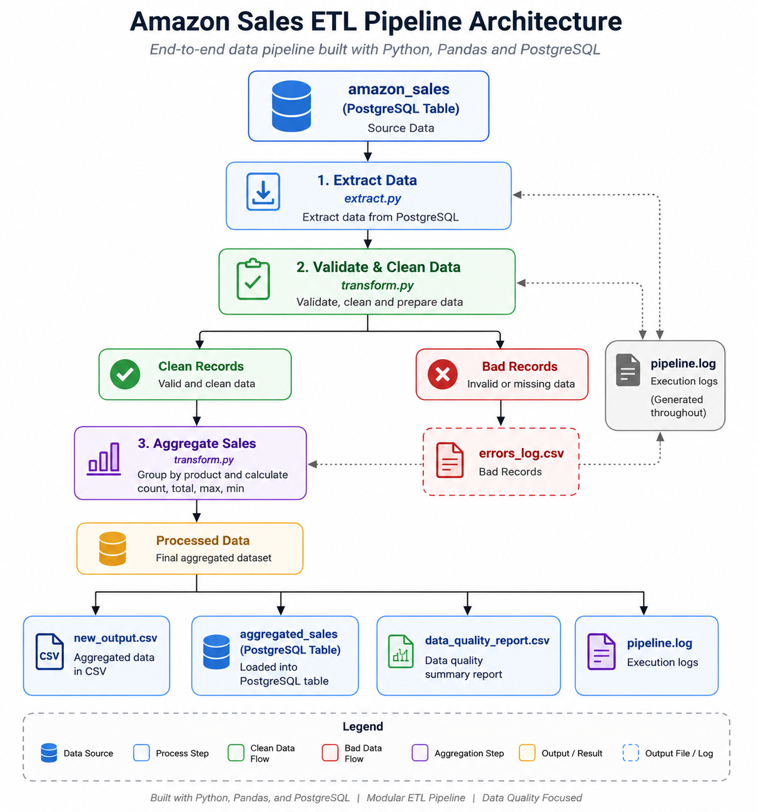
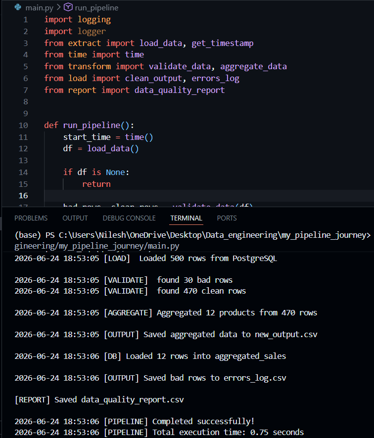
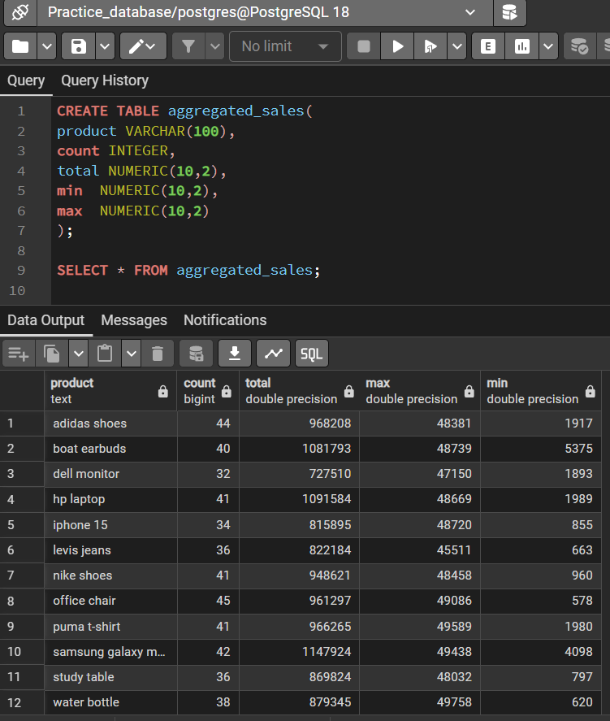
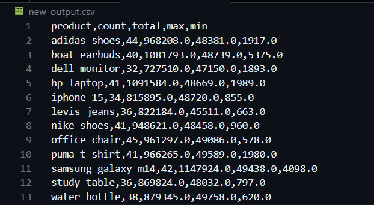
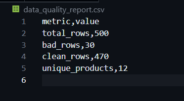
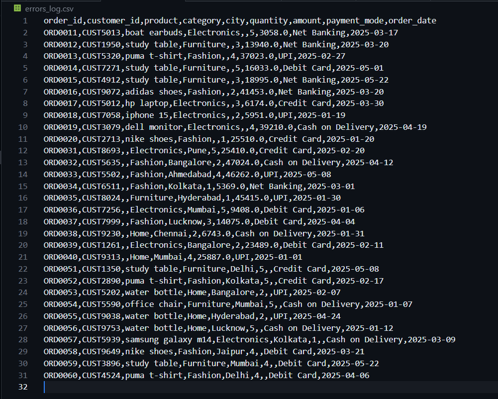

# Amazon Sales ETL Pipeline

An end-to-end ETL pipeline built with **Python**, **Pandas**, and **PostgreSQL** that extracts raw sales data, validates and transforms it, aggregates product-level metrics, generates data quality reports, and loads processed results back into PostgreSQL.

This project is part of my Data Engineering learning journey, where I continuously improve a single pipeline by introducing more realistic ETL practices such as modular architecture, logging, reporting, and error handling.

---

# 📖 Project Overview

This project simulates a simplified production-style ETL workflow.

Instead of simply cleaning data and exporting a CSV, the pipeline focuses on building a maintainable workflow that includes:

- Data extraction from PostgreSQL
- Data validation and cleaning
- Error logging
- Product-level aggregation
- CSV export
- PostgreSQL loading
- Data quality reporting
- Pipeline execution logging

---

# 🏗️ Pipeline Architecture



The pipeline follows a traditional ETL workflow where raw sales data is extracted from PostgreSQL, validated and transformed, aggregated into business-ready metrics, and finally exported to multiple destinations while generating monitoring artifacts.

---

# 📸 Pipeline in Action

## Pipeline Execution

Complete execution of the ETL pipeline from extraction to loading.



---

## PostgreSQL Output

Aggregated sales data successfully loaded into the **aggregated_sales** table.



---

## Aggregated CSV Output

Generated CSV containing aggregated product-level sales metrics.



---

## Data Quality Report

Automatically generated pipeline quality report.



---

## Error Log

Invalid or incomplete records identified during validation.



---

# 🔄 Pipeline Workflow

```
                PostgreSQL (amazon_sales)
                         │
                         ▼
                  Extract Sales Data
                         │
                         ▼
               Validate & Clean Data
                  ┌────────┴────────┐
                  ▼                 ▼
           Clean Records      Invalid Records
                  │                 │
                  ▼                 ▼
        Aggregate Product Sales   errors_log.csv
                  │
                  ▼
          Aggregated Results
        ┌─────────┼──────────────┐
        ▼         ▼              ▼
 new_output.csv aggregated_sales data_quality_report.csv
                (PostgreSQL)

          pipeline.log (generated throughout)
```

---

# ✨ Features

- Extract data directly from PostgreSQL
- Validate and clean incoming records
- Standardize product names
- Detect invalid records
- Separate bad records into an error log
- Aggregate sales metrics by product
- Export processed data to CSV
- Load aggregated data back into PostgreSQL
- Generate data quality reports
- Track total pipeline execution time
- Maintain timestamped execution logs
- Modular ETL architecture

---

# 🛠️ Tech Stack

| Technology | Purpose |
|------------|----------|
| Python | Core programming language |
| Pandas | Data transformation |
| PostgreSQL | Source & Destination Database |
| SQLAlchemy | Database loading |
| psycopg2 | PostgreSQL connectivity |
| Git | Version control |
| GitHub | Repository hosting |

---

# 📂 Project Structure

```
my-pipeline-journey/

│
├── main.py
├── extract.py
├── transform.py
├── load.py
├── report.py
├── logger.py
├── requirements.txt
├── README.md
│
├── Docs/
│   └── Images/
│       ├── Pipeline_architecture.png
│       ├── Terminal_output.png
│       ├── SQL_table_aggregated_sales.png
│       ├── new_output_csv.png
│       ├── data_quality_report_csv.png
│       └── errors_log_csv.png
│
├── output/
│
├── Pyspark_learning/
│
└── ...
```

---

# 🚀 How to Run

```bash
git clone https://github.com/nileshraut-analytics/my-pipeline-journey.git

cd my-pipeline-journey

pip install -r requirements.txt

python main.py
```

---

# 📊 Pipeline Outputs

### Aggregated Sales Report

**new_output.csv**

Contains:

- Product
- Transaction Count
- Total Revenue
- Maximum Sale
- Minimum Sale

---

### Error Log

**errors_log.csv**

Contains all invalid records removed during validation.

---

### Data Quality Report

**data_quality_report.csv**

Provides:

- Total Rows
- Bad Rows
- Clean Rows
- Unique Products

---

### PostgreSQL Output

**aggregated_sales**

Stores the final aggregated dataset inside PostgreSQL.

---

### Pipeline Log

**pipeline.log**

Maintains timestamped logs for every stage of pipeline execution.

---

# 📈 Project Evolution

This repository documents the continuous evolution of a single ETL pipeline rather than a collection of unrelated projects.

| Version | Improvement |
|----------|-------------|
| Version 1 | Basic Python data processing |
| Version 2 | Pandas transformations |
| Version 3 | Modular ETL architecture |
| Version 4 | PostgreSQL integration |
| Version 5 | Error handling & logging |
| Version 6 | Data quality reporting |
| Version 7 | Documentation & project architecture |

The objective has been to improve one pipeline step by step while introducing concepts commonly found in real-world data engineering workflows.

📄 See [CHANGELOG.md](CHANGELOG.md) for a detailed, dated history of fixes and changes made to this pipeline.

---

# ⚙️ Core Modules

### extract.py

Extracts raw sales data from PostgreSQL.

### transform.py

Responsible for:

- Validation
- Cleaning
- Aggregation

### load.py

Handles:

- CSV export
- PostgreSQL loading
- Error logging

### report.py

Generates data quality reports.

### logger.py

Configures centralized pipeline logging.

### main.py

Acts as the pipeline orchestrator by executing every ETL stage in sequence.

---

# 🔮 Future Improvements

Planned enhancements include:

- PySpark implementation
- Docker containerization
- Apache Airflow orchestration
- AWS S3 integration
- Environment variable configuration
- Unit testing
- CI/CD pipeline

---

# 🎯 Learning Goal

Rather than building many unrelated projects, this repository focuses on continuously improving a single ETL pipeline while gradually introducing more realistic engineering practices.

The goal is to build strong fundamentals before moving toward distributed processing with PySpark, workflow orchestration with Apache Airflow, and cloud-based data engineering.

---

# 👨‍💻 Author

**Nilesh Raut**

Aspiring Data Engineer

Currently learning **Python, SQL, PostgreSQL, Pandas, and PySpark** while building end-to-end data engineering projects and documenting the journey through progressively improved versions of the same pipeline.
